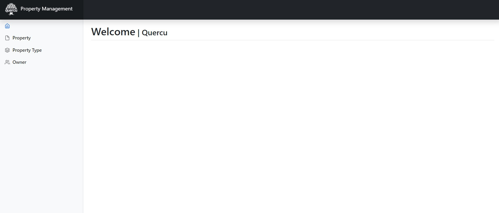
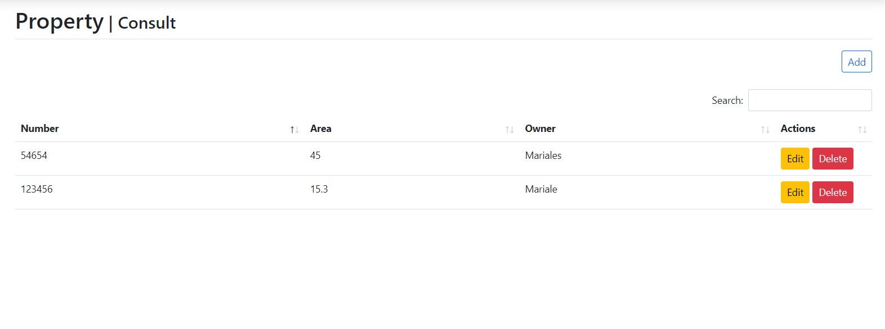
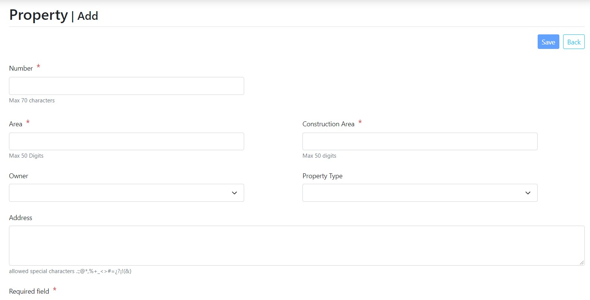
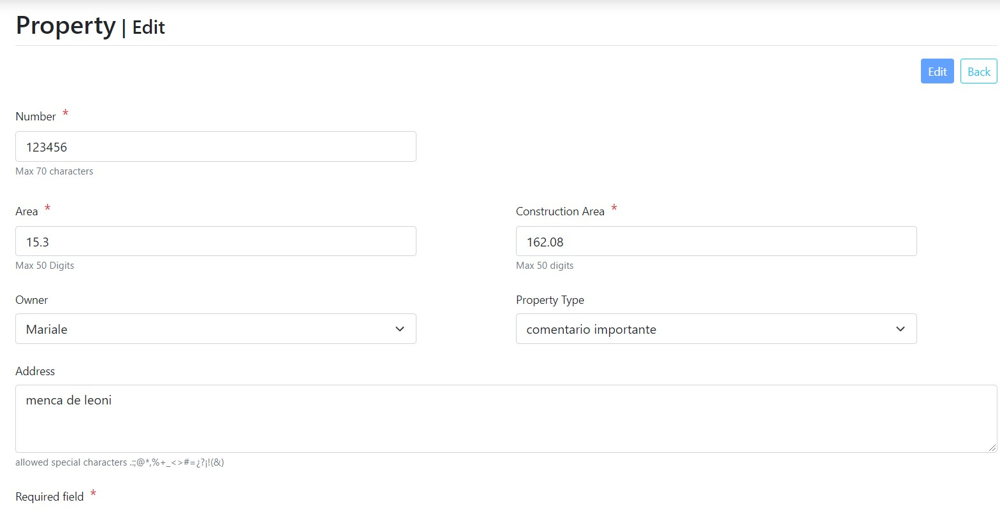
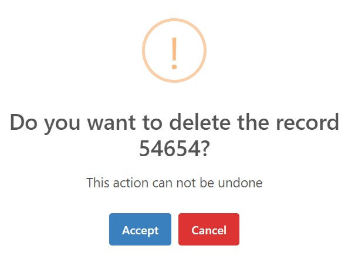
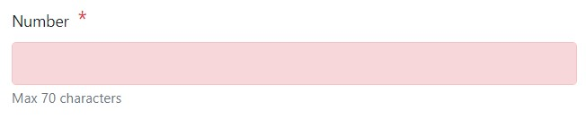
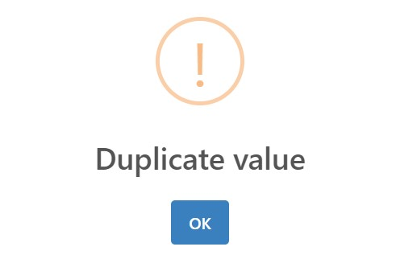

# App Property Management

_Se encuentra estructurado por tres modulos, en donde se incluyerón librerías, estilos y comportamientos utilizando el framework Codeigniter. Se tiene los siguientes modulos:_

- Owner: se indica datos del owner como su nombre, número de identificacion, telefono, entre otros
- Proper Type: se indica una breve descripción.
- Property: se definen los datos de la propiedad, el owner asignado y tipo de propiedad.
  
## Comenzando 🚀

### Versiones 📋

Al momento del desarrollo se trabajo con las siguientes versiones:

- APACHE 2.4.46 
- PHP 7.3.29  
- MariaDB 10.4.14 - MySQL 5.0.12
- Codeigniter 3.1.11
  - Para implementar el framework, se requiere PHP >=5.3.7 y copiar la carpeta del proyecto en el servidor web

### Librerías

- Bootstrap v5.1.3
- sweeater2 11.3.4: se utilizo para realizar las notificaciones
- Datatable 1.11.3: se implemento en el listado de registros almacenados en la accion consulta 

### Instalación

- En el equipo local, ubicarse en el directorio a descargar y ejecutar Git Bash. Ejecutar el siguiente comando:  

```
git clone https://github.com/Maleja/property-management.git
```
- Ubicar el archivo bd.sql, ubicado en la raiz del proyecto
- Crear en la bd lo siguiente, al finalizar ejecutar el archivo bd.sql:
```
- BD PropertyManagement
- Usuario: admin
- Password: *admin**

* En caso de utilizar otras credenciales, se debe actualizar los valores de conexión en el archivo application/config/database.php
```
- Ruta de la aplicacion
  - https://localhost/property-management/
  



### Estructura del módulo

A continuación se indica la estructura y comportamiento de los módulos:

- Contienen las acciones: consultar, agregar y editar.
- Cada módulo inicia con la acción consultar, en donde se listan los registros existentes permitendo editar o eliminar en cada registro. Contiene el botón *Add* para ingresar al módulo para agregar registros .



- Acción Agregar / Editar: se indican los campos requeridos y opcionales, cada campo tiene una leyenda del tamaño máximo o carácteres especiales permitidos, al guardar los cambios se valida si existen valores duplicados. 
  - *Agregar:* Contiene el botón *Save*. Al guardar los cambios se redirecciona a la accion Editar.
  - *Agregar / Editar:* contiene el botón *Back*, permite regresar a la acción consultar, en caso de tener datos sin guardar se indica una notidicación.
  - *Editar:* Contiene el botón *Edit*.





  - *Editar / Eliminar*: se muestran las opciones en los registros listados de la acción consultar



## Validaciones

- En caso de presentar un error con el valor ingresado, se colocará en rojo el campo. Entre las condiciones: valor requerido, valor duplicado, no cumple con la cantidad mínima de carácteres o caracter ingresado no válido




### Campos unicos por módulo

- Property:
  - Number
- Property Type:
  - Identification Number
  - Email
  - Name
- Owner:
  - Description
